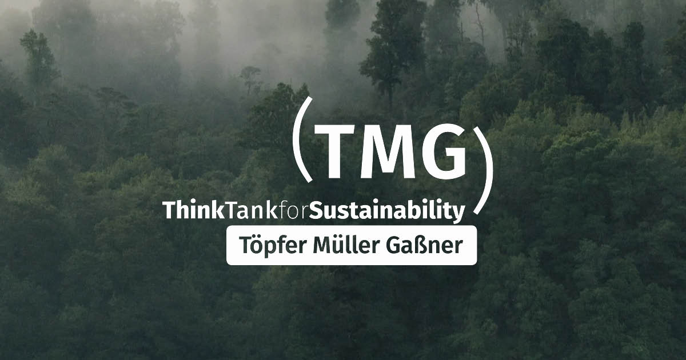

## Description

This repo contains the website of [TMG Think Tank for Sustainability](https://tmg-thinktank.com), a non-profit and consultancy based in Berlin working on sustainability transformations.

## Technologies

The site is a [Sveltekit](https://kit.svelte.dev/) project deployed on [Vercel](https://vercel.com/). Data is sourced from [Contentful](https://contentful.com/) and styling is done with [Tailwind CSS](https://tailwindcss.com).

## Installation

1. Use the git CLI to clone the repo

```
gh repo clone brunosj/tmg-thinktank
```

2. Install dependencies

```bash
npm install
# or
yarn install
```

3. Navigate into the site's directory and start the development server

```bash
npm run dev
# or
yarn dev
```

Open [http://localhost:5173](http://localhost:5173) with your browser to see the result.

## Structure

```
.
├── node_modules
└── src
    ├── lib
    ├── routes
    ├── app.html
    ├── app.css
├── static
├── .eslintignore
├── .eslintrc.cjs
├── .gitignore
├── .npmrc
├── .prettierignore
├── .prettierrrc
├── package-lock.json
├── package.json
├── postcss.config.js
├── README.md
├── svelte.config.js
├── tailwind.config.js
└── vite.config.ts
```

## Further development

This repository is maintained by [brunosj](https://github.com/brunosj).
